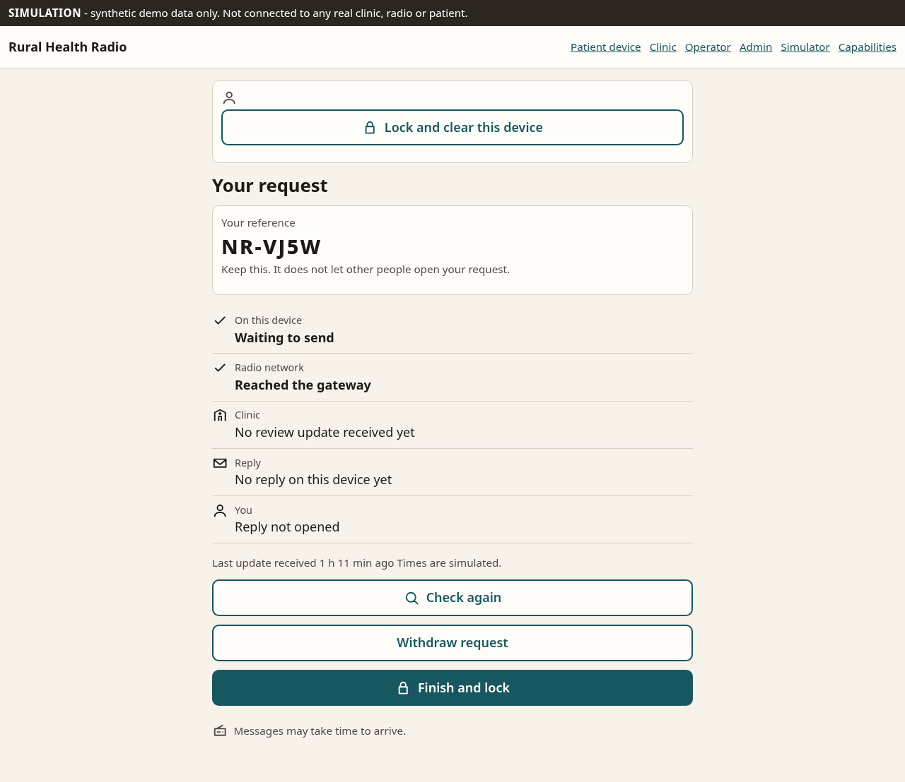
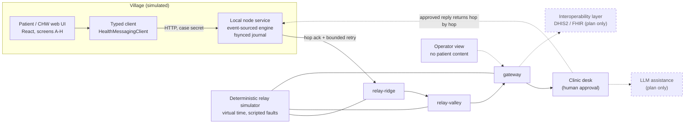

# Rural Health Radio — simulated prototype

> **SIMULATION. NOT A MEDICAL DEVICE. SYNTHETIC DATA ONLY.**
> Nothing in this repository transmits over a real radio, reaches a real clinic, or contains a real patient. Every screen shows a simulation banner. Do not use it for care, triage, or emergencies.

**Rural Health Radio is a messaging system that stays honest when the network does not.** A person far from a clinic writes a short request on a phone. A village node saves it to disk _before_ it says "accepted", relays it hop by hop through a gateway to a clinic, and a **clinician-approved** reply travels back. At every moment the patient sees only what is actually known: _waiting to send_, _the gateway has it_, _the clinic received it_, _a reply arrived_, _it was opened_ - each from evidence, never from hope.



**Try the full scripted demo** (outage, restart, restore, separate gateway and clinic acknowledgements, clinician approval, return-path interruption, duplicate delivery producing one case, operator view without patient content, lock): `npm run dev`, then follow [docs/DEMO.md](docs/DEMO.md); it runs unattended as `e2e/spec-demo.spec.ts`. Silent captioned videos are in [`submission/`](submission/SUBMISSION.md).

**Scope, honestly:** everything runs in a simulator on one laptop with synthetic data. See the [capability matrix](docs/CAPABILITIES.md) (also at `#/capabilities`) for what is simulated, implemented, evaluated (by automated tests only) and still missing.

This repo implements the **P0 "Noor" vertical flow** plus the Stage A product-spec items listed below, against a deterministic relay simulator and a real local service with a durable write-ahead journal.

## Live demo

**Live demo: <https://rural-health-radio.vercel.app>** The hosted demo runs this same simulated service with synthetic data and a banner on every screen: _"Hosted demo: state may reset; durable journal is demonstrated in the local build and tests"_. The whole Noor journey (patient, clinic approval, operator view, simulator controls) works there, but state is one shared demo state for all visitors (a database-backed command log, resettable from `#/sim`), so restart-durability and the on-disk journal are demonstrated in the local build and tests, not on the hosted URL. Deploy options (Vercel with a shared database log, or Docker/Render) and exact steps: [docs/DEPLOY.md](docs/DEPLOY.md).

## Quick start

Requires Node 20+.

```bash
npm ci
npm run dev        # local service :8787 + web UI :5173  -> open http://localhost:5173
# or, single process serving the built UI:
npm start          # http://127.0.0.1:8787
```

| Command                                 | Purpose                                                                                        |
| --------------------------------------- | ---------------------------------------------------------------------------------------------- |
| `npm run check`                         | typecheck + lint + format check + Vitest                                                       |
| `npm test`                              | Vitest: logic, durability (incl. SIGKILL), relay simulator, API                                |
| `npm run test:e2e`                      | Builds, starts the real service, Playwright + axe at 320px/1280px                              |
| `npm run build:server` / `build:vercel` | Hosted-demo bundles (single Node server / Vercel output); see [docs/DEPLOY.md](docs/DEPLOY.md) |
| `npm run evidence:bytes`                | Regenerates `docs/measurements/request-bytes.md`                                               |
| `npm run evidence:contrast`             | Regenerates `docs/measurements/contrast.md`                                                    |

Useful views: patient app `#/`, clinic `#/clinic`, operator `#/operator`, relay simulator `#/sim` (advance virtual time, cut links/power, restart the node, inject lost acks). `?fixtures=1` runs the patient UI on static fixtures with no service.

Demo sign-in (**not real authentication**): the staff views offer synthetic accounts. Only the clinician role can approve a reply; this is enforced in the service, not just hidden in the UI.

Staff demo sign-ins (tokens in `src/shared/fixtures.ts`): clinician Dr. Amina, clinician Dr. Baraka (for handover), coordinator Juma, community health worker Grace, network operator, deployment administrator Zawadi. Extra views: `#/admin` (settings, permission table, audit trail) and `#/capabilities` (capability and language matrices).

Environment: `RHR_PORT` (default 8787), `RHR_DATA_DIR` (default `data/`), `RHR_SIM_CONTROLS=off` (removes every `/api/sim/*` simulator endpoint; the harness is not part of a real deployment).

## What the prototype demonstrates

1. **Patient flow (screens A–H):** language access → home → choose request → details → "is this what you meant?" → review and consent → receipt → reply. Works at 320px, with 200% text, RTL, and a helper-assisted mode for someone reading with a community health worker.
2. **Honest receipt:** a case is "waiting to send", "relaying", "received by clinic", "reply arrived", "reply opened" — each only from evidence the node actually holds. Delays show ages ("sent 3 h ago"), never invented arrival times.
3. **Durability:** the node journals each command before acknowledging it, `fsync`s, truncates a torn final record on restart, and rebuilds all state by replay. Tested with power cuts and a real `SIGKILL`.
4. **Relay custody:** hop-by-hop acks, bounded retry with backoff, duplicate delivery, reordered acks, lost data and lost acks, link outages, node power-off, TTL expiry, and idempotent resubmission with the same message id.
5. **Clinic desk:** inbox, claim, start review, **clinician-only approval** of a reply (assistive draft with provenance; coordinators/CHWs/operators and unauthenticated callers are rejected), staff priority with provenance.
6. **Operator view:** health of the network with **no patient content**.
7. **Gateway as an explicit module:** separate inbox and outbox with independent radio-side and upstream-side outage handling. The gateway acknowledges to the village on its own; the clinic acknowledgement is a separate, later fact. (Journal-derived state in this prototype, not a separate process or disk.)
8. **Roles enforced in the service:** patient (case secret), community health worker, clinic reviewer, clinic coordinator, network operator (never any clinical content), deployment administrator. Unauthorized-access tests at service and HTTP level.
9. **Clarification and correction:** the clinic can ask an approved question; the patient's answer is a linked follow-up in the same case. Corrections create linked versions; withdrawal is explained honestly (forwarded copies cannot be erased).
10. **Clinic coverage:** a staffing _statement_ (never inferred; stale after 4 h is labelled), overdue vs the review window, audited handover, and closure with an explicit outcome (administrative; asserts no health outcome).
11. **Consent records and audit events** (identifiers only, no names or message text); admin settings changes are attributed. **Village node health** indicators (availability, storage, queue age, radio adapter status, last sync).
12. **Voice input** behind a swappable adapter (see the table below).
13. **Privacy basics:** a village device needs its case secret (`Authorization: Case <secret>`); a case reference alone returns 401. Switching patient wipes the device draft; drafts have a 24 h retention policy.

## Architecture

Derived from the concept in the source plan (a layered radio network for delay-tolerant messaging, where amateur-radio spectrum is explicitly _not_ a deployment basis). Solid boxes are implemented here (simulated); dashed boxes are plan-only.



Code map: `src/shared` (contract and pure logic), `src/server` (engine, journal, simulator, auth, HTTP), `src/web` (UI). See [CONTRIBUTING.md](CONTRIBUTING.md).

## What is simulated and what is not

| Area                         | Status in this repo                                                                                                                                                                                                                                                                                                                                                     |
| ---------------------------- | ----------------------------------------------------------------------------------------------------------------------------------------------------------------------------------------------------------------------------------------------------------------------------------------------------------------------------------------------------------------------- |
| Radio / RF links             | **Simulated.** Virtual time (1 tick = 1 simulated minute), scripted loss. No RF, no spectrum, no range claims.                                                                                                                                                                                                                                                          |
| Relay, gateway, clinic       | **Simulated** nodes inside one process, driven by the simulator.                                                                                                                                                                                                                                                                                                        |
| Local node service           | **Real code, real disk journal**, but runs on a laptop, not on target hardware.                                                                                                                                                                                                                                                                                         |
| Compact wire codec           | **Prototype** binary codec; no encryption, FEC, or framing. Sizes are measured, airtime is inference.                                                                                                                                                                                                                                                                   |
| Draft summary                | **Deterministic rules.** No AI model. Output is a draft for a human.                                                                                                                                                                                                                                                                                                    |
| Translation                  | **Mock phrase dictionary.** Always flags non-English as needing review.                                                                                                                                                                                                                                                                                                 |
| Swahili and Arabic           | **UNREVIEWED demo strings.** Not checked by a qualified medical translator; stated in the UI.                                                                                                                                                                                                                                                                           |
| Voice input (speech-to-text) | **Implemented behind an adapter** (browser Web Speech API). **Browser speech recognition may send audio to a third-party service**, so a consent line is shown before first use; this app records and stores no audio. Recognition quality for en/sw/ar is **UNKNOWN** (tests use a scripted fake). Typing always works; unsupported/denied/error show a plain message. |
| At-rest encryption           | **None.** Journal and drafts are plaintext (synthetic data only).                                                                                                                                                                                                                                                                                                       |
| Authentication               | **Demo tokens only.** Header navigation between views is a demo convenience.                                                                                                                                                                                                                                                                                            |
| DHIS2 / FHIR / LLM assist    | **Plan only.** Not built. No interoperability is claimed.                                                                                                                                                                                                                                                                                                               |
| Clock quality                | Village and relay nodes are marked "unsynced"; the UI never claims synchronized time.                                                                                                                                                                                                                                                                                   |

## Evidence labels

Every claim in this repo's docs is labelled:

- **FACT** — measured or tested here; conditions stated; reproducible with a command.
- **INFERENCE** — reasoned from facts plus stated assumptions; may be wrong.
- **UNKNOWN** — not known; needs real-world data or review.

See [VERIFICATION.md](VERIFICATION.md) for test counts, measured byte sizes, accessibility results, and what is still unvalidated. A [screenshot walkthrough](docs/DEMO.md) of the Noor journey and the Stage A demo is in `docs/`.

## Not done (Stage A gaps we did not build)

- Patient-unavailable workflow (pending-reply indicator, no-detail notifications).
- Integration service (DHIS2 / FHIR adapters, reconciliation).
- At-rest encryption; real identity and credential management (demo tokens only).
- A separate gateway process with its own disk (the gateway is a module over journal-derived state).
- Enforced data retention (the setting is recorded, not enforced); facilities, nodes, staff-access and incident administration.
- Any evaluation with real users, real radios or in the field.

## Open decisions (need people, not code)

1. **Country and radio authorization.** Which spectrum, licences, and rules apply where. Amateur-radio spectrum is **not** a deployment basis.
2. **Hardware.** Node, radio, power, enclosure, and cost for village and relay sites.
3. **Phone-to-node connection.** Wi-Fi hotspot, Bluetooth, or other, and how a phone finds its node.
4. **Languages and review.** Which languages, and qualified reviewers for medical wording (sw/ar are currently unreviewed).
5. **Staffing.** Who runs the clinic desk, and with what response expectations.
6. **Identity, consent, and retention.** How cases are tied to people, consent wording, and retention law.
7. **Facility directory** and routing rules.
8. **External systems.** Mapping to DHIS2 / FHIR, if wanted.
9. **Security and privacy review**, including at-rest encryption and real authentication.
10. **Clinical safety review** of templates, drafts, and escalation wording.

## License

MIT — see [LICENSE](LICENSE).
