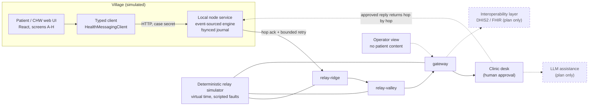

# Rural Health Radio — simulated prototype

> **SIMULATION. NOT A MEDICAL DEVICE. SYNTHETIC DATA ONLY.**
> Nothing in this repository transmits over a real radio, reaches a real clinic, or contains a real patient. Every screen shows a simulation banner. Do not use it for care, triage, or emergencies.

A prototype of **delay-tolerant rural health messaging**: a person with no reliable connectivity writes a short request on a phone, a local node stores it durably, a chain of relay nodes carries it hop by hop to a gateway and a clinic, and a clinician-approved reply travels back. The point is to make _honest waiting_ usable: the patient always sees what is known, what is not, and what to do next.

This repo implements the **P0 "Noor" vertical flow** end to end, against a deterministic relay simulator and a real local service with a durable write-ahead journal.

## Quick start

Requires Node 20+.

```bash
npm ci
npm run dev        # local service :8787 + web UI :5173  -> open http://localhost:5173
# or, single process serving the built UI:
npm start          # http://127.0.0.1:8787
```

| Command                     | Purpose                                                           |
| --------------------------- | ----------------------------------------------------------------- |
| `npm run check`             | typecheck + lint + format check + Vitest                          |
| `npm test`                  | Vitest: logic, durability (incl. SIGKILL), relay simulator, API   |
| `npm run test:e2e`          | Builds, starts the real service, Playwright + axe at 320px/1280px |
| `npm run evidence:bytes`    | Regenerates `docs/measurements/request-bytes.md`                  |
| `npm run evidence:contrast` | Regenerates `docs/measurements/contrast.md`                       |

Useful views: patient app `#/`, clinic `#/clinic`, operator `#/operator`, relay simulator `#/sim` (advance virtual time, cut links/power, restart the node, inject lost acks). `?fixtures=1` runs the patient UI on static fixtures with no service.

Demo sign-in (**not real authentication**): the clinic and operator views offer demo staff accounts (clinician, coordinator, community health worker, operator); tokens are listed in `src/shared/fixtures.ts`. Only the clinician role can approve a reply.

Environment: `RHR_PORT` (default 8787), `RHR_DATA_DIR` (default `data/`).

## What the prototype demonstrates

1. **Patient flow (screens A–H):** language access → home → choose request → details → "is this what you meant?" → review and consent → receipt → reply. Works at 320px, with 200% text, RTL, and a helper-assisted mode for someone reading with a community health worker.
2. **Honest receipt:** a case is "waiting to send", "relaying", "received by clinic", "reply arrived", "reply opened" — each only from evidence the node actually holds. Delays show ages ("sent 3 h ago"), never invented arrival times.
3. **Durability:** the node journals each command before acknowledging it, `fsync`s, truncates a torn final record on restart, and rebuilds all state by replay. Tested with power cuts and a real `SIGKILL`.
4. **Relay custody:** hop-by-hop acks, bounded retry with backoff, duplicate delivery, reordered acks, lost data and lost acks, link outages, node power-off, TTL expiry, and idempotent resubmission with the same message id.
5. **Clinic desk:** inbox, claim, start review, **clinician-only approval** of a reply (assistive draft with provenance; coordinators/CHWs/operators and unauthenticated callers are rejected), staff priority with provenance.
6. **Operator view:** health of the network with **no patient content**.
7. **Privacy basics:** a village device needs its case secret (`Authorization: Case <secret>`); a case reference alone returns 401. Switching patient wipes the device draft; drafts have a 24 h retention policy.

## Architecture

Derived from the concept in the source plan (a layered radio network for delay-tolerant messaging, where amateur-radio spectrum is explicitly _not_ a deployment basis). Solid boxes are implemented here (simulated); dashed boxes are plan-only.



Code map: `src/shared` (contract and pure logic), `src/server` (engine, journal, simulator, auth, HTTP), `src/web` (UI). See [CONTRIBUTING.md](CONTRIBUTING.md).

## What is simulated and what is not

| Area                      | Status in this repo                                                                                            |
| ------------------------- | -------------------------------------------------------------------------------------------------------------- |
| Radio / RF links          | **Simulated.** Virtual time (1 tick = 1 simulated minute), scripted loss. No RF, no spectrum, no range claims. |
| Relay, gateway, clinic    | **Simulated** nodes inside one process, driven by the simulator.                                               |
| Local node service        | **Real code, real disk journal**, but runs on a laptop, not on target hardware.                                |
| Compact wire codec        | **Prototype** binary codec; no encryption, FEC, or framing. Sizes are measured, airtime is inference.          |
| Draft summary             | **Deterministic rules.** No AI model. Output is a draft for a human.                                           |
| Translation               | **Mock phrase dictionary.** Always flags non-English as needing review.                                        |
| Swahili and Arabic        | **UNREVIEWED demo strings.** Not checked by a qualified medical translator; stated in the UI.                  |
| Voice input               | **Not implemented.** The UI says speaking is unavailable and offers typing or a health worker.                 |
| At-rest encryption        | **None.** Journal and drafts are plaintext (synthetic data only).                                              |
| Authentication            | **Demo tokens only.** Header navigation between views is a demo convenience.                                   |
| DHIS2 / FHIR / LLM assist | **Plan only.** Not built.                                                                                      |
| Clock quality             | Village and relay nodes are marked "unsynced"; the UI never claims synchronized time.                          |

## Evidence labels

Every claim in this repo's docs is labelled:

- **FACT** — measured or tested here; conditions stated; reproducible with a command.
- **INFERENCE** — reasoned from facts plus stated assumptions; may be wrong.
- **UNKNOWN** — not known; needs real-world data or review.

See [VERIFICATION.md](VERIFICATION.md) for test counts, measured byte sizes, accessibility results, and what is still unvalidated. A [screenshot walkthrough](docs/DEMO.md) of the Noor journey is in `docs/`.

## Open decisions (need people, not code)

1. **Country and radio authorization.** Which spectrum, licences, and rules apply where. Amateur-radio spectrum is **not** a deployment basis.
2. **Hardware.** Node, radio, power, enclosure, and cost for village and relay sites.
3. **Phone-to-node connection.** Wi-Fi hotspot, Bluetooth, or other, and how a phone finds its node.
4. **Languages and review.** Which languages, and qualified reviewers for medical wording (sw/ar are currently unreviewed).
5. **Staffing.** Who runs the clinic desk, and with what response expectations.
6. **Identity, consent, and retention.** How cases are tied to people, consent wording, and retention law.
7. **Facility directory** and routing rules.
8. **External systems.** Mapping to DHIS2 / FHIR, if wanted.
9. **Security and privacy review**, including at-rest encryption and real authentication.
10. **Clinical safety review** of templates, drafts, and escalation wording.

## License

MIT — see [LICENSE](LICENSE).
